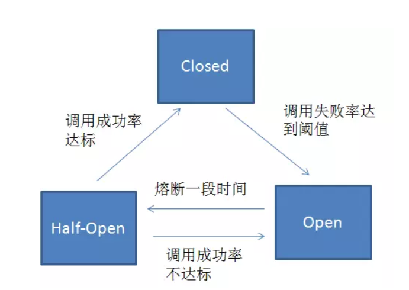
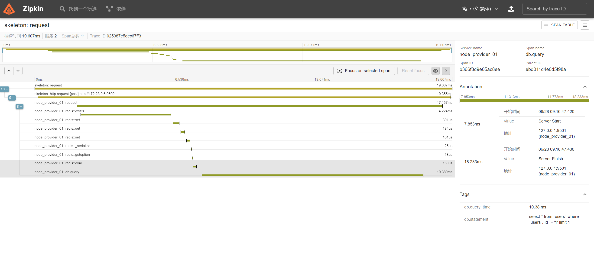
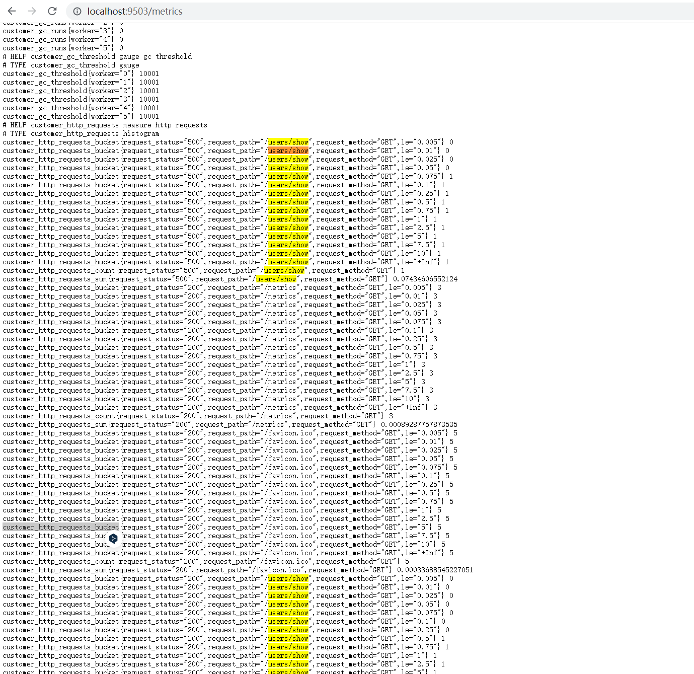
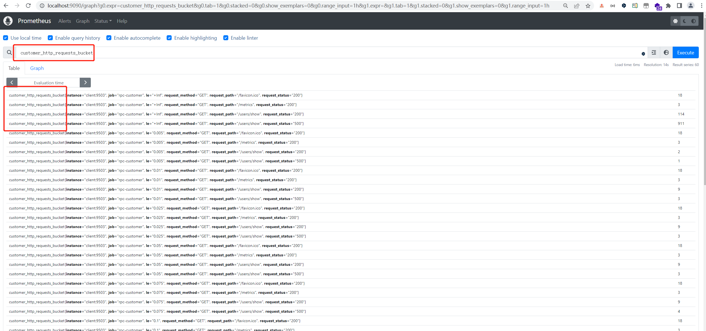
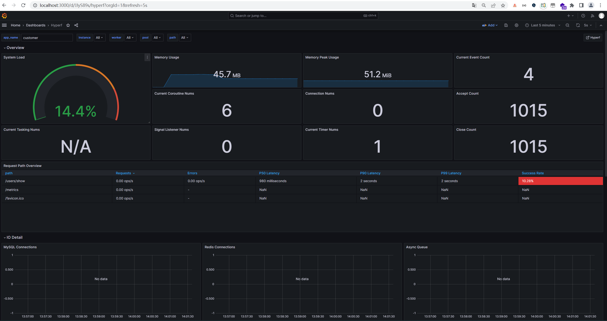
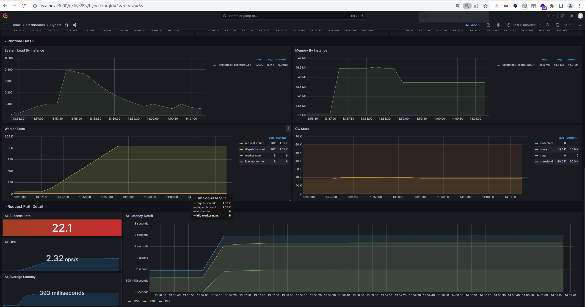

docker-compose up [--build] -d
docker-compose up [--build] -d server

mysql8 默认账户为 root
redis6 默认账户为 default


```sql
CREATE TABLE `users` (
    `id` bigint unsigned NOT NULL AUTO_INCREMENT,
    `name` varchar(255) CHARACTER SET utf8mb4 COLLATE utf8mb4_general_ci NOT NULL,
    `gender` tinyint(1) NOT NULL DEFAULT 0,
    `created_at` timestamp NULL DEFAULT now(),
    `updated_at` timestamp NULL DEFAULT now(),
    PRIMARY KEY (`id`) USING BTREE
) ENGINE=InnoDB DEFAULT CHARSET=utf8mb4 COLLATE utf8mb4_general_ci;
```


### Composer
`composer config -g repo.packagist composer https://mirrors.aliyun.com/composer`


### server -- 服务提供者
```shell
composer require hyperf/json-rpc
composer require hyperf/rpc-server
```

* 不需要控制器

* 进入容器执行（TODO: 但是没理 method 是如何对应上的???）:
    ```shell
    # 创建用户
    curl --location 'http://127.0.0.1:9600/' \
    --header 'Content-Type: application/json' \
    --data '{
        "jsonrpc": "2.0",
        "method": "/user/createUser",
        "params": {
            "name": "李四",
            "gender": 1
        }
    }'

    # 查询用户 
    curl --location 'http://127.0.0.1:9600/' \
    --header 'Content-Type: application/json' \
    --data '{
        "jsonrpc": "2.0",
        "method": "/user/getUserInfo",
        "params": {
          "id": 1
        },
        "id": "",
        "context": []
    }'
  
    # 用户不存在情况，message 查看报错的具体容器ip
    curl --location 'http://172.28.0.5:9600/' \
    --header 'Content-Type: application/json' \
    --data '{
        "jsonrpc": "2.0",
        "method": "/user/getUserInfo",
        "params": {
          "id": 99
        },
        "id": "",
        "context": []
    }'
    ```

* 【重要】关于请求与路由的说明（这里没有定义路由，怎么就可以通过路由进行访问了？）:
    * 看 UserService.php 注解中 `name: "UserService"` 指服务，**Hyperf 在底层会把 UserService 中的 User 取出并转为小写，然后拼接当前服务类中的方法，并组成路由**。
    * 如 UserService.php 中有 `getUserInfo` 方法，那么路由就是 `/user/getUserInfo`


### client -- 服务消费者
* 消费者是 http 请求，消费者再请求 rpc服务提供者

```shell
composer require hyperf/json-rpc
composer require hyperf/rpc-client
```

* 外部浏览器访问: http://localhost:9501/users/show?id=1

* 外部 curl 创建数据:
  ```shell
  curl --location 'http://localhost:9501/users/store' \
  --header 'Content-Type: application/json' \
  --data '{
      "name": "李2",
      "gender": 1
  }'
  ```

* 自动创建消费者:
    * app/JsonRpc/Service/UserService.php 的作用只是为了构建发起请求的参数和返回结果，hyperf 支持自动配置服务消费者代理类.

    * 还是通过上面的访问方式


# Consul -- 服务注册、发现
* Consul 是微服务架构中，解决服务发现、配置中心的分布式中间件

* 启动参数说明：
  ```shell
  -dev：表示开发环境模式运行；
  
  -server：以服务端身份启动（注册中心）；
  
  -client：指定客户端访问的 ip，0.0.0.0 表示不限制客户端 IP；
  
  -ui：开启 web 界面访问；
  
  -bootstrap-expect=3：表示 server 集群最低节点数为 3，低于该值工作不正常；
  
  -data-dir：表示指定数据的存储目录（该目录必须先创建）；
  
  -node：表示节点在 web ui 中显示的名称。
  ```

* 常用命令:
  ```shell
  # 查看集群节点
  consul members
  
  # 重新加载配置文件
  consul reload
  
  # 优雅的关闭节点
  consul leave
  
  # 查询所有注册服务
  consul catalog services
  ```


### 上 -- 【服务注册】，构建服务提供者
```shell
# 安装 consul 组件
composer require hyperf/service-governance-consul
   
# 生成配置文件
# 该命令会在 config/autoload 目录下生成 services.php 文件
php bin/hyperf.php vendor:publish hyperf/service-governance
```

* 测试 consul 服务：
  ```shell
  # server 容器内执行
  curl --location 'http://localhost:9600/' \
  --header 'Content-Type: application/json' \
  --data '{
      "jsonrpc": "2.0",
      "method": "/user/test",
      "params": {}
  }'
  
  # 如果 server/config/autoload/server.php 配置是指定容器内 ip 的话
  curl --location 'http://172.28.0.5:9600/' \
  --header 'Content-Type: application/json' \
  --data '{
      "jsonrpc": "2.0",
      "method": "/user/test",
      "params": {}
  }'
  ```

* 浏览器查看服务: http://localhost:8500/ui/dc1/services


### 下 -- 【服务发现】，构建消费者使用服务
* `composer require hyperf/service-governance-consul`

* client 配置 `config/autoload/services.php`

* 外部浏览器访问: http://localhost:9501/users/show?id=1


### consul 负载均衡
* virtual 准备4台虚拟机，桥接模式。其中 master 使用 docker 安装 mysql redis

```shell
# 1. 服务端启动 consul （TODO： 如何后台启动啊？ 加 & 是临时解决方案）
consul agent -server -bind=192.168.20.35 -client=0.0.0.0 -ui -bootstrap-expect=3 -data-dir=/home/u/consul/data/ -node=server-01 &

consul agent -server -bind=192.168.20.36 -client=0.0.0.0 -ui -bootstrap-expect=3 -data-dir=/home/u/consul/data/ -node=server-02 &

consul agent -server -bind=192.168.20.37 -client=0.0.0.0 -ui -bootstrap-expect=3 -data-dir=/home/u/consul/data/ -node=server-03 &


# 2. 消费端以 client 模式启动
consul agent -client=0.0.0.0 -data-dir=/home/u/consul/data/ -ui -bind=192.168.20.38 -node=client-01 &


# 3. 除了 192.168.20.35 都执行
consul join 192.168.20.35

# master 运行 mysql 8
docker run -d \
    --name test-mysql8 \
    -p 3306:3306 \
    -v $PWD/cnf:/etc/mysql/conf.d \
    -v $PWD/data:/var/lib/mysql \
    -v /etc/localtime:/etc/localtime:ro \
    -e MYSQL_ROOT_PASSWORD=mysql112233 \
    mysql:8.0.31

# master 运行redis5， redis.conf 参考 blog
docker run -d \
    --name test-redis5 \
    -p 6379:6379 \
    -v $PWD/redis.conf:/etc/redis/redis.conf \
    -v $PWD/data:/data \
    redis:5.0.13 \
    redis-server /etc/redis/redis.conf \
    --appendonly yes \
    --requirepass "redis112233"

# 配置 APP_NAME DB 等
cp .env.example .env
php bin/hyperf.php start


# 访问 consul master 的 web ui
http://192.168.20.35:8500/ui/dc1/services

http://192.168.20.35:8500/ui/dc1/nodes


# 访问 client 接口:
http://192.168.20.38:9501/users/show?id=1

http://192.168.20.38:9501/users/test


# 压测，太多扛不住咋回事
ab -n 1000 -c 10 'http://192.168.20.38:9501/users/show?id=1'
```


### Nacos 集群
* https://www.ziruchu.com/art/666

* TODO: 可以单机试试


### 服务限流
* 服务限流指在高并发情况下，为了保护系统正常运行，从而对象访问服务的请求进行限制，从而保证服务的高可用

#### 为什么需要服务限流
* 把系统拆分为微服务之后，每个微服务可能会存在相互调用的关系，若其中某个服务被突如其来的大流量击垮，可能会引发 **雪崩** ，导致相关的微服务都不可用，从而影响业务。

####【方案1：服务提供者中实现限流】Server  -- 针对所有请求的限流（不是针对用户 ID）
```shell
# 安装限流组件
composer require hyperf/rate-limit

# 该限流组件默认使用 redis 作为存储，也以把 redis 装上
composer require hyperf/redis


# 限流组件 -- 生成配置
# 该组件会在 config/autoload 目录下生成 rate_limit.php 文件
php bin/hyperf.php vendor:publish hyperf/rate-limit

# redis 组件
# 该组件会在 config/autoload 目录下生成 redis.php 文件
php bin/hyperf.php vendor:publish hyperf/redis

# 限流代码 app/JsonRpc/Service/UserService.php
```

* 需要注意： 该限流是【针对所有请求】进行的，而不是针对具体用户。
    * 如最大支持 1000 个请求，假如说某一个用户一瞬间请求了 1000 次，后面后续的用户都将触发限流机制。
    * 如果要针对用户进行限流，达到 A 用户被限流，B 用户正常请求，可以根据用户 ID 进行。

* 浏览器访问（不断 f5 刷新就能看到限流响应）: http://localhost:9501/users/show?id=1
    * 如果没效果则删除 server 的 runtime 目录


####【方案2：服务消费者中实现限流】Client  -- 控制器中实现对用户限（针对用户 ID）
```shell
# 安装限流组件
composer require hyperf/rate-limit
# 生成配置文件
php bin/hyperf.php vendor:publish hyperf/rate-limit

# 限流代码 app/Controller/UserController.php
```

* 浏览器访问（不断 f5 刷新就能看到限流响应）: http://localhost:9501/users/test?user_id=2
    * 如果没效果则删除 client 的 runtime 目录


#### 限流总结
* TODO: 思考一下限流做在服务提供者好还是做在服务消费者更好？

* TODO: 但是 rate_limit.php 配置并不能很直观的看出支持每秒多少个请求啊？？？？


### 服务熔断
* 复杂的分布式系统中，服务之间往往存在着相关依赖的关系，一个服务出现问题可能会导致整个服务处于可用状态。

* 那么，为什么需要服务熔断，了解服务熔断之前先来了解下服务雪崩、服务降级。

#### 服务雪崩
* 服务雪崩，一个服务因某些不可用，从而导致所有与之关联的服务不可用，这种情况称为服务雪崩。

* 有 2 种手段可以解决服务雪崩，分别是 **服务熔断** 和 **服务降级**

#### 服务熔断
* 什么是服务熔断： 当下游服务器某些原因导致服务不用或请求变慢或失败时，上游服务为了保护系统整体的可用性，可以暂时切断对下游服务的调用，直接返回，快速释放资源。直到目标服务情况好转则恢复调用。

* 目前熔断器有： 阿里出的 Sentinel，Netfilx 的 Hystrix 和 基于 Hystrix 实现的 Spring Cloud Hystrix。

#### 熔断设计有三个模块：**熔断请求判断算法**、**熔断恢复机制**、**熔断报警**
* 熔断请求判断算法：使用无锁循环队列计数，每个熔断器默认维护 10 个 bucket，每 1 秒一个 bucket，每个 blucket 记录请求的成功、失败、超时、拒绝的状态，默认错误超过 50% 且 10 秒内超过 20 个请求进行中断拦截。

* 熔断恢复：对于被熔断的请求，每隔 5s 允许部分请求通过，若请求都是健康的（RT<250ms）则对请求健康恢复。

* 熔断报警：对于熔断的请求打日志，异常请求超过某些设定则报警。

#### 熔断器状态: 
1. 初始状态，服务器无故障时，熔断器处于 `closed` 状态；

2. 固定时间内（Hystrix 默认是 10 秒），接口调用出错比率达到一个阈值时（ Hystrix 默认为 50%），会进入熔断 `open` 开启状态。进行熔断状态后，后续调用该服务的请求不再经过网络，直接执行本地的  
   fallback 方法；

3. 在进入熔断开启状态一段时间之后（Hystrix 默认是 5 秒），熔断器会进入 `half-open `半熔断状态。所谓半熔断就是尝试恢复服务调用，允许有限的流量调用该服务，并监控调用成功率。如果成功率达到预期，则说明服务已恢复，进入熔断关闭状态；如果成功率仍旧很低，则重新进入熔断开启状态。

4. 在尝试一段时间后，服务还没有恢复，则进入本地的服务降级的逻辑处理。


### 服务降级 【重要】
* 服务降级一般是在服务器压力剧增的情况下，根据实际情况以及流量，对一些 **非核心服务** 进行有策略的 **延迟使用** 或 **暂停使用**，从而释放服务器资源，保证重要服务的可用。

* 简单地说，就是在高并发情况下，系统资源是有限的，非核心业务让道核心业务，优先保证核心业务的使用。

* 服务降级所考虑的问题:
    * 核心和非核心业务;
    * 是否支持降级，降级策略;
    * 业务放通的场景，策略。

* 降级分类:
    * 按照是否自动化分为：自动开关降级和人工开关降级;
    * 按照功能分为：读服务降级、写服务降级;
    * 按照处于系统层次分为：多级降级。

* 降级策略:
    * 限流降级；
    * 熔断降级；
    * 页面拒绝服务：页面提示由于服务繁忙此服务暂停；
    * 延迟持久化：页面访问照常，但是涉及记录变更，会提示稍晚能看到结果，将数据记录到异步队列或 log，服务恢复后执行。

#### 降级与熔断之间的区别
* 触发原因不一样：**服务熔断** 一般是某个服务故障引起；而 **服务降级** 一般是从整理负载情况考虑；

* 熔断可以理解成实现服务降级的一种手段：进入熔断后，后续对该服务的调用不再经过网络，直接执行本地默认方法，从而达到服务降级的效果。

#### 怎么实现自动降级
1. 超时降级：配置超时时间和重试次数，并使用异步探测机制探测恢复情况；

2. 失败次数降级：对于不稳定的 API，当失败次数达到一定阈值时进行自动降级，需要使用异步探测恢复情况；

3. 故障降级：若远程服务器不可用（网络故障、DNS 故障、HTTP 服务返回错误的状态码和 RPC 服务抛出异常），可以降级；

4. 限流降级：触发限流机制时，可以使用暂时屏蔽的方式来进行短暂的屏蔽。


### 服务熔断 -- 代码实现
1. 服务提供者: sleep 模拟耗时业务

2. 服务消费者: 安装熔断器， 在控制器实现熔断设置
```shell
composer require hyperf/circuit-breaker

CircuitBreaker 熔断器注解参数说明：
# 参数	            含义
options	        配置选项，如 timeout=0.5 设置超时时间
failCounter	    超时次数大于等于1，开启熔断器
successCounter	成功次数大于等于3，关闭熔断器
duration	        熔断后，重新恢复服务调用的时间，10秒内新的请求会执行 fallback 方法
fallback	        用于指定熔断时执行的方法
```

3. 消费者访问触发:
    * 触发熔断: http://localhost:9501/users/testCircuitBreaker?id=1
    * 不触发熔断: http://localhost:9501/users/testCircuitBreaker?id=-1


### 使用 Zipkin 分布式调用链追踪
* hyperf 官方提供了一款非常好用的分布式调用链追踪组件—— hyperf/tracer。该组件可以对和各个跨网络请求进行追踪分析，**包括请求方法、异常、Guzzle HTTP 调用、Redis 调用、DB 调用都可以进行监听**，还能通过可视化界面进行监控管理。

* 参考: https://www.ziruchu.com/art/671
```shell
# 安装
docker pull openzipkin/zipkin
# 启动
docker run --name zipkin -d -p 9411:9411 openzipkin/zipkin


# 安装调用链追踪组件
composer require hyperf/tracer
# 可选
# hyperf/tracer 组件默认安装了 Zipkin 相关依赖
# 若要看 redis 效果，可以安装该组件
composer require hyperf/cache

php bin/hyperf.php vendor:publish hyperf/tracer

# 通过中间件形式采集（服务端、客户端都要配置，只配置一端似乎也行，取决于需求）
\Hyperf\Tracer\Middleware\TraceMiddleware::class
```

* 后台： http://localhost:9411/zipkin/

* 使用过程：
    1. 访问消费者 http://localhost:9501/users/show?id=1
    2. 去 Zipkin 查看调用链路 http://localhost:9411/zipkin/
    3. 
    4. 如果是访问异常 http://localhost:9501/users/show?id=999 ， 可以在 zipkin 看到标红提示，且能分析 trace

* TODO: 了解更新 Zipkin 的功能以及实战作用
    * 比如正式环境一致开启这个？？


### 使用 Prometheus + Grafana 监控服务
* https://www.ziruchu.com/art/672

* 服务上线后，需要知道服务的健康状态、服务资源使用情况、慢查询、业务埋点等情况，通过监控就可以掌握这些情况，以便进行后续优化操作。

* Prometheus （中文名：普罗米修斯）是由 SoundCloud 开发的开源监控报警系统和时序列数据库(TSDB)。它是一个监控采集与数据存储框架（监控服务器端），具体采集什么数据依赖于Exporter（监控客户端）。

* Grafana 是一个跨平台的开源的度量分析和可视化工具，可以通过将采集的数据查询然后可视化的展示，并及时通知。一般是和一些时间序列数据库进行配合来展示数据的。

* 一句话了解：Prometheus 是时间序列数据库，它负责提供数据，Grafana 负责对这些数据指标进行可视化展示。

* 访问 prometheus: http://localhost:9090
    * http://localhost:9090/targets

* 访问消费者 9503 端口:
    1. 消费者接口访问: http://localhost:9501/users/show?id=1
    2. 消费者 metrics 访问(注意端口不一样): http://localhost:9503/metrics
       1.  
    3. 在 metrics 页面搜索关键字 "users/show" 就能看到如下的日志:
    ```shell
    ...
    customer_http_requests_bucket{request_status="500",request_path="/users/show",request_method="GET",le="0.005"} 0
    customer_http_requests_bucket{request_status="500",request_path="/users/show",request_method="GET",le="0.01"} 0
    ...
    ```
    4. 在 http://localhost:9090/graph 搜 customer_http_requests_bucket 也能看到
       1.  

* 访问 grafana: http://localhost:3000 -- 【Grafana 配置 Prometheus 数据源】
    1. 账号密码 admin 登录 grafana
    2. 界面点击 DATA SOURCES (添加数据源)
    3. 选择 Prometheus ， 填入 http://prometheus:9090 保存
    4. 查看 Data sources: http://localhost:3000/connections/datasources
    5. http://localhost:3000/dashboard/import 导入仪表盘, 填入内容复制 grafana.json
    6. 
    7. 
    8. ab 测试使面板有数据: `ab -n 100 -c 10 'http://localhost:9501/users/show?id=1'`
